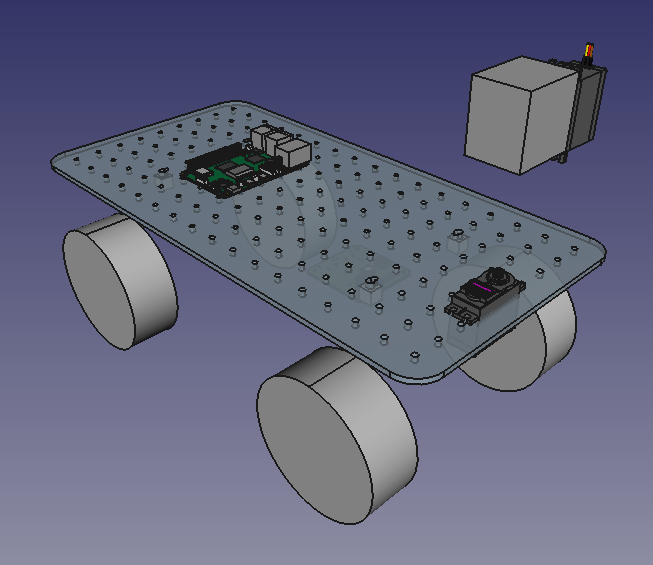

# parts list
* [rc-car](https://www.hobbylinna.fi/fi/product/ftx-outback-2-ranger-4x4-rtr-1:10-trail-crawler-ftx5586/FTX5586)
    * [battery](https://github.com/netl/rover-bms)
        * adapter cable
        * bms
        * charge detect?
    * [module plate](#module-plate)
        * [esc]
        * [can-rover]
            * [link cable](#link-cable)
* [mounting plate](#mounting-plate)
    * m3
        * [screws](https://www.aliexpress.com/item/1005007426850496.html)
        * [threads](https://www.aliexpress.com/item/1005003582355741.html)
    * rpi 5
        * mounting hardware
            * [screws](https://www.aliexpress.com/item/1005007426850496.html)
            * [threads](https://www.aliexpress.com/item/1005003582355741.html)
            * [cheese plate adapter](#rpi-plate)
        * [shield](https://github.com/netl/can-shield)
            * canbus
            * power
            * status
            * [link cable](#link-cable)
        * [camera](https://www.aliexpress.com/item/1005004647231020.html)
            * [mount](#camera-mount)
    * [telemetry](https://github.com/netl/can-telemetry)
        * canbus
        * compass
        * gyro
        * [gps](https://docs.px4.io/main/en/gps_compass/gps_holybro_m8n_m9n.html)
        * [lidar](https://www.slamtec.com/en/C1)
        * [link cable](#link-cable)
    * [estop](https://www.aliexpress.com/item/32676446818.html)
    * charge port?
        * cv + cc?

# custom hardware

## module plate
mounts in place of original receiver/esc
* holes for
    * [can-rover]
    * rc car frame
* [esc]
* [camera mount](#camera-mount)

## mounting plate
* 6 mm thick
* cheese plate

## rpi plate
* m2.5 holes for rpi
* pattern for cheese plate

## camera mount
[camera] to [module plate](#module-plate)

## link cable
JST XH4 ~10 cm

[can-rover]:https://github.com/netl/can-rover
[esc]:https://www.aliexpress.com/item/1005005866547271.html
[camera]:https://www.aliexpress.com/item/1005004647231020.html
